# Ironport Vulnerability: Privilege Escalation of via SSH PubKey Injection
Moving to Virtual Appliance (VA) _blackboxes_ has a number of advantages for appliance vendors as well as  the end consumers of said devices. Hardware issues are now nonexistent and rapid (re)deployment are among them.

That being said, the vendors have given up a level of obfuscation that was provided with the hardware appliances. Below is tutorial outlining the trivial steps necessary to enable the service user (with root privileges) and install an SSH public key for persistence.

##### Timeline:
__Disclosure to Vendor:__ 2016-10-03

__Vendor Response:__ 2016-10-04

__Vendor Fix/Patch:__ TBA

__Public Disclosure:__ TBA

##### Meta:
__Cisco Bug IDs:__ TBA

#### Requirements
* __Hypervisor__ capable of Hosting 2 virtual machines (VMware Fusion is used in this document).
  * __Content Security VA__ (ESA, SMA, or WSA)
    * Post initial setup.
  * __FreeBSD VM__ (recommended) or Linux Virtual Machine
* `admin` credentials to said VA.
* A client workstation with SSH public keys generated. ([Tutorial HERE](https://help.github.com/articles/generating-a-new-ssh-key-and-adding-it-to-the-ssh-agent/#generating-a-new-ssh-key))

## Instructions
#### 1. Prep
###### On the Hypervisor:
* Both the __Content Security VA__ and the __FreeBSD VM__ need to be shutdown.
* Manually add a the  __Content Security VA__ disk image to the __FreeBSD VM__.
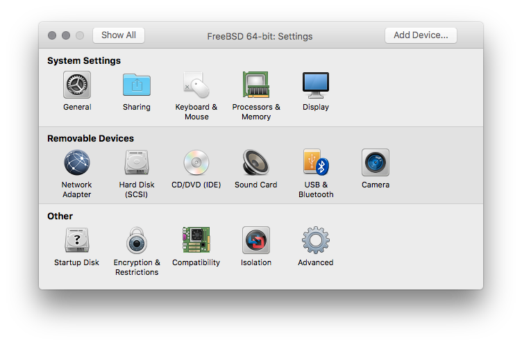
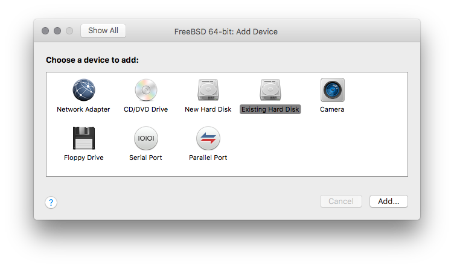
* _Be sure to select the `Share this virtual disk...` option._
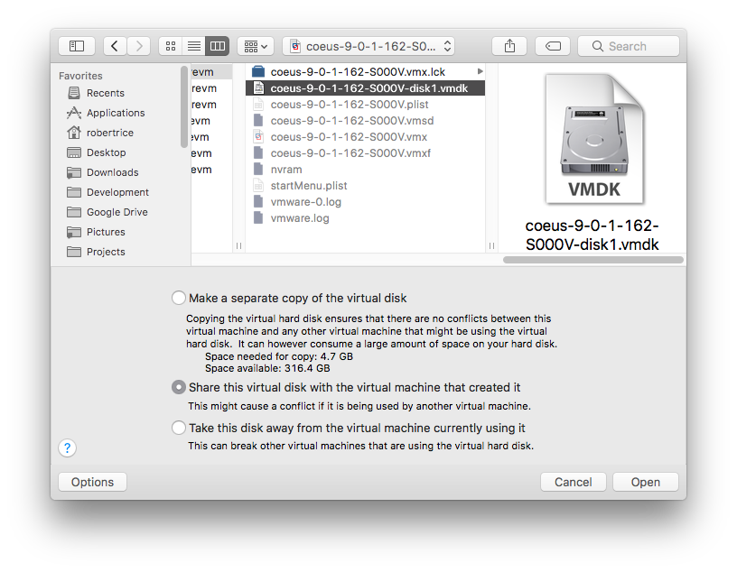
* _Verify that you are still going to boot to the `FreeBSD` disk, and not the appliance's._
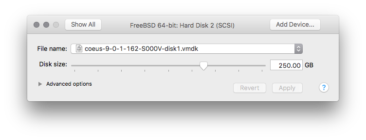

#### 2. Startup and Discovery
###### On the Hypervisor:
* Start up the __FreeBSD VM__ and make sure it still boots to the original HD (NOT the __Content Security VA__ image).
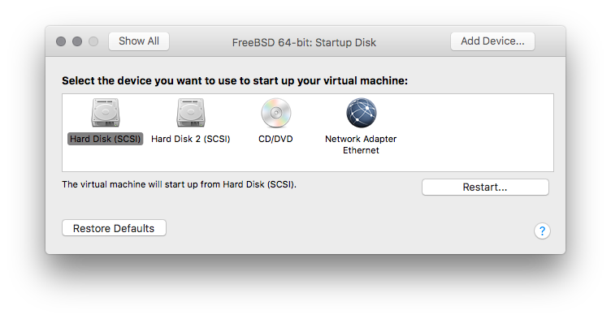

###### On the FreeBSD VM:
* Determine the device label of the __Content Security VA__'s disk. (Mine was `/dev/da1*`)
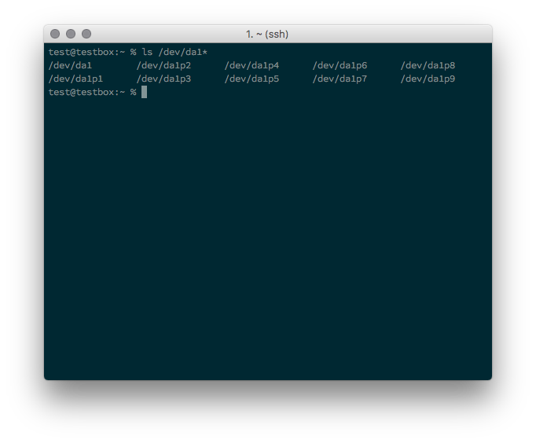
* There are multiple available on the drive, so we will need to determine which is useful for this demonstration. (The 3rd partition was root).
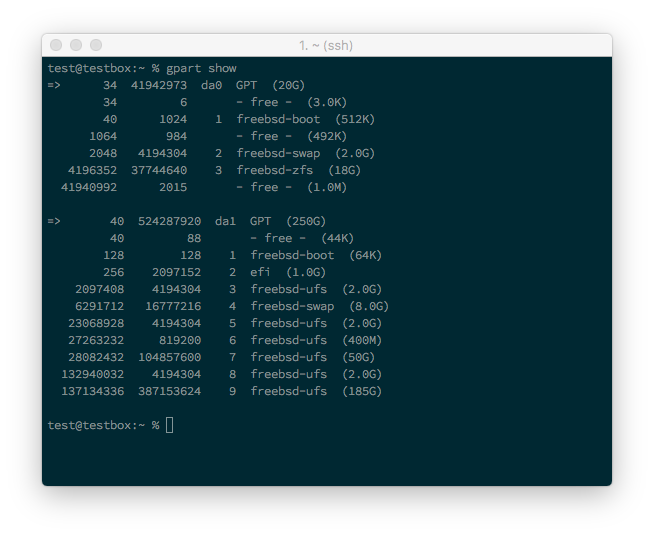

#### 3. Installing the Public-Key
###### On the FreeBSD VM:
* Mount the partition we need as R/W with `mount -o rw /dev/da1p3 /wsa`
* Add the SSH public key to the `/wsa/root/.ssh/authorized_keys`
* Unmount the disk with `umount /dev/da1p3`
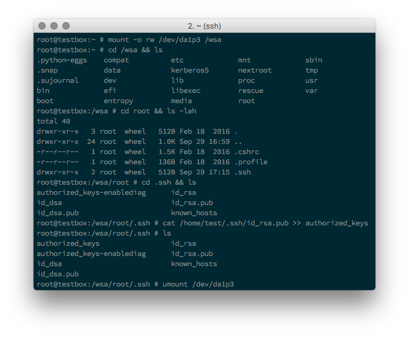
* Shutdown the FreeBSD VM

###### On the Hypervisor:
* Remove the __Content Security VA__ from the Hypervisor.
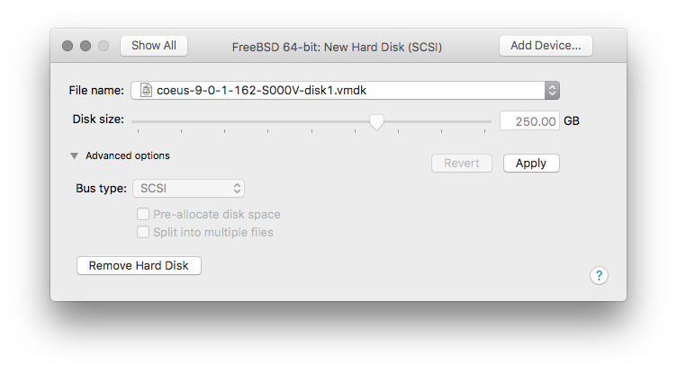

#### 4. Verifying the results.

###### On the Hypervisor:
* Start up the __Content Security VA__.

###### On the __Content Security VA__:
* Run the following commands: `techsupport` > `sshaccess`
* _The seed key selection doesn't matter for this case because we are using SSH pub keys for authentication._

###### On the client system:
* SSH to the appliance using the `service` as the user.
* _If necessary, specify the SSH private key._
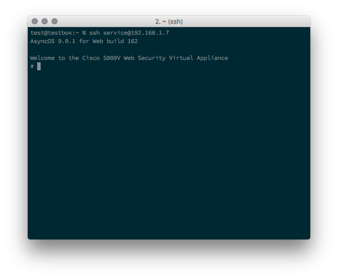
* Once logged in, you will have access to the service user which is a root user on the appliance.
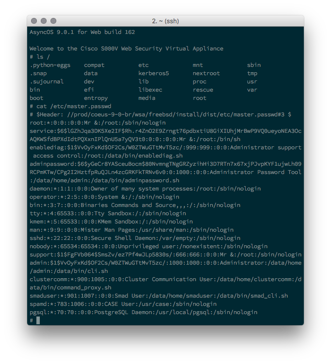

## Comments:
1. The service user is enabled and disabled via the `techsupport` command, but the `SSHACCESS` option doesn't make any TCP connections _phoning home_.
2. Adding the SSH public key means that this exploit won't interfere with the normal operation of the remote technical support function. _I've had two TAC cases where the technician requested access, and they didn't mention anything._
